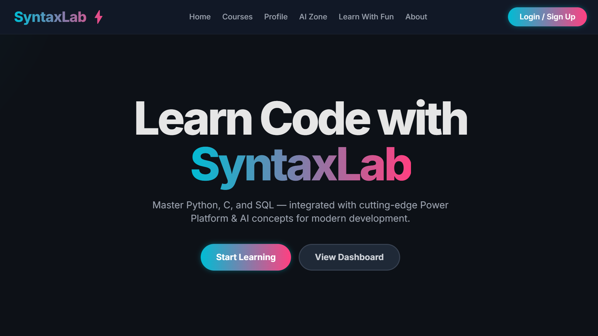
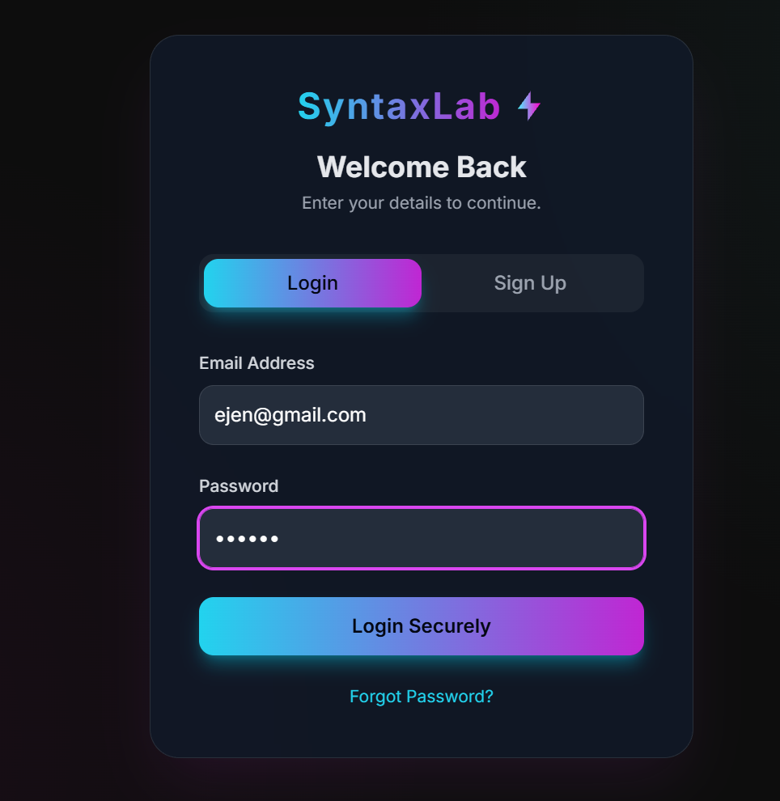
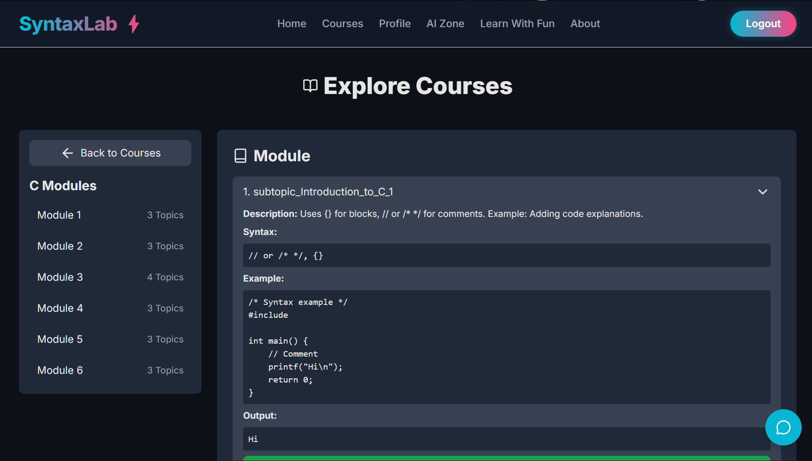
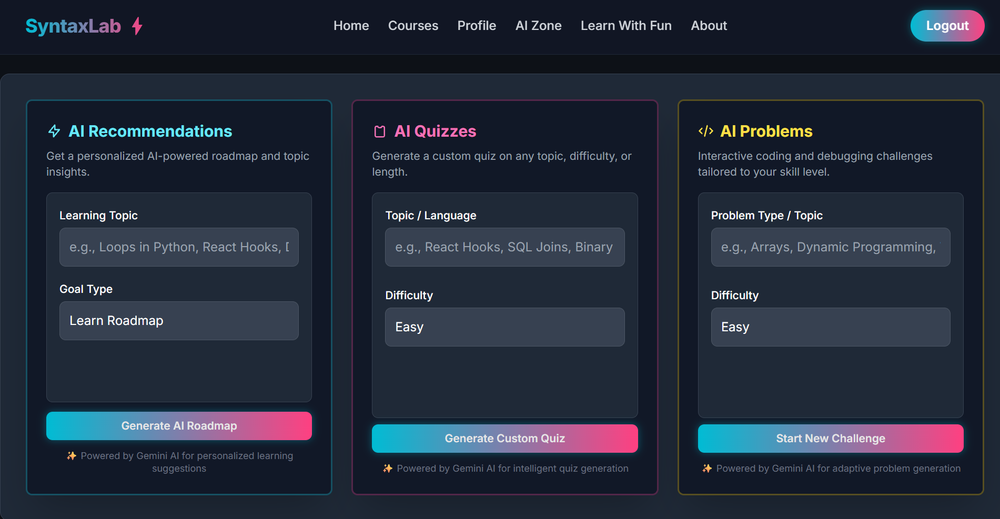
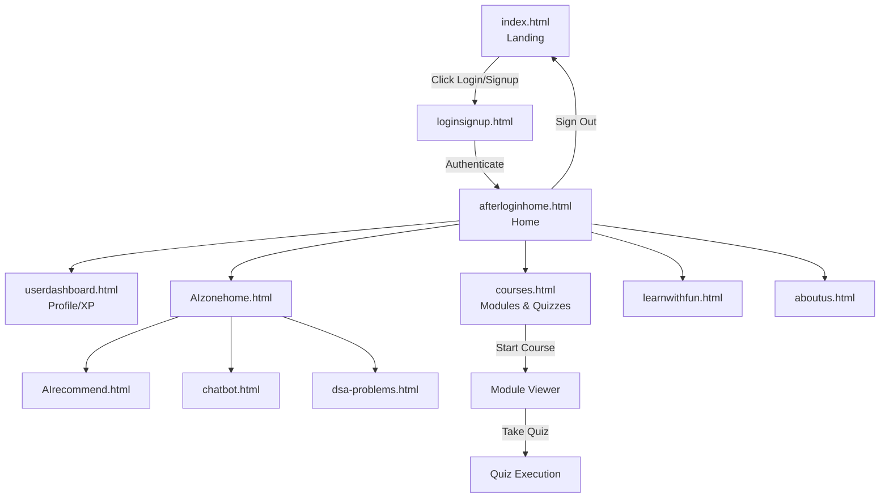
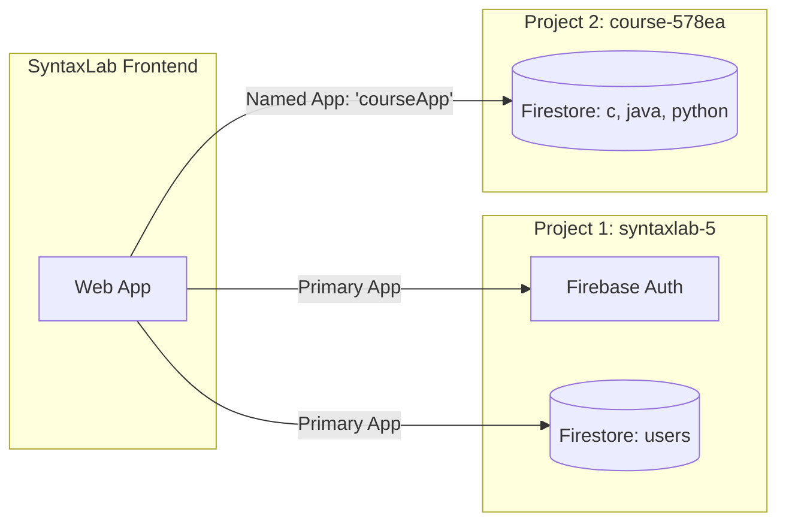

# 🚀 SyntaxLab

<div align="center">
  
  
  
  
  
</div>

<p align="center">
  <b>Code Mastery, Accelerated.</b>
</p>

<p align="center">
  <a href="https://borrakarthik509.github.io/syntaxlab-ai-learning-platform/">
    
  </a>
</p>

## 🔗 Live Demo

**[https://borrakarthik509.github.io/syntaxlab-ai-learning-platform/](https://borrakarthik509.github.io/syntaxlab-ai-learning-platform/)**

> Hosted on GitHub Pages. The deployed domain is registered in Firebase Authentication's authorized domains list, so login and signup work directly on the live site.

## 📸 Preview

<details open>
<summary><b>Landing Page & Auth</b></summary>
<br>
<i>Landing Page highlighting the Hero section and Courses:</i><br>

<br>

<i>Secure authentication flow via Firebase Auth:</i><br>

</details>

<details open>
<summary><b>Dashboard & Course Content</b></summary>
<br>
<i>Interactive Course Modules with Code Examples and Output:</i><br>

<br>

<i>AI Zone for Recommendations, Quizzes, and Coding Problems:</i><br>

</details>

## 📋 Project Overview

| Category | Technology |
| --- | --- |
| **Frontend Core** | Vanilla JavaScript (ES Modules), HTML5, CSS3 |
| **Styling** | Custom CSS + Tailwind CSS (via CDN) |
| **Icons & Charts** | Lucide Icons, Chart.js (Dashboard visualizations) |
| **Authentication** | Firebase Auth (Email/Password, Custom Token, Anonymous) |
| **Database** | Firebase Firestore (Two distinct projects) |
| **Live Hosting** | [GitHub Pages](https://borrakarthik509.github.io/syntaxlab-ai-learning-platform/) |

## ✨ Features

- **Dual-Project Firebase Architecture**: User progression and authentication are safely decoupled from the educational course content.
- **Gamified Progression System**: Users earn XP (10 XP per topic) and climb through 6 distinct ranks (from *Newbie Spark* to *Syntax Master*) with dynamic progress bars.
- **Milestone Badges**: Unlockable achievements (e.g., *Kilo Coder*, *Elite Coder*) tied directly to XP thresholds.
- **Live Leaderboard**: Real-time top 5 ranking system comparing user XP.
- **Dynamic Content Loading**: Courses, subtopics, and quizzes are fetched directly from Firestore and rendered asynchronously.
- **AI Integration Area**: Dedicated views for AI-powered coding recommendations, tailored quizzes, and interactive DSA problems.
- **Fully Responsive UI**: Mobile-first design implemented with Tailwind CSS and custom responsive classes, featuring micro-animations (Scroll reveal, hover glows).

## 🎯 Problem It Solves

Learning to code often requires bouncing between tutorials, documentation, and external platforms like LeetCode. SyntaxLab consolidates the learning experience. By combining structured course modules (Python, C, Java), gamified progress tracking, and AI-assisted debugging in a single platform, it keeps learners engaged without context switching.

## 📄 Pages & User Flow



<details>
<summary><b>Detailed Page Breakdown</b></summary>

- **`index.html`**: The public landing page showcasing core curriculum, "Why Choose SyntaxLab", and community integration features.
- **`loginsignup.html`**: The authentication gateway managing login and registration states.
- **`afterloginhome.html`**: The private home view accessible only after successful authentication.
- **`userdashboard.html`**: Visualizes user progression, current rank, XP progress via Chart.js, earned badges, and the live leaderboard.
- **`courses.html`**: The main learning hub. Fetches modules, renders code syntax, tracks subtopic completion, and executes quizzes.
- **`AIzonehome.html`**: Central hub for AI features. Links out to `AIrecommend.html` (dynamic roadmaps), `chatbot.html` (interactive debugging), and `dsa-problems.html`.
- **`quizgenerator.html` / `learnwithfun.html`**: Supplementary interactive learning views.
</details>

## 🗂️ Data Architecture

SyntaxLab uses a **Dual-Firebase-Project** pattern. This separates user Personal Identifiable Information (PII) and progress from the read-heavy, publicly accessible educational content.



- **`syntaxlab-5` (Primary)**: Handles authentication. The `users` collection stores `uid`, `name`, `email`, `xp`, and arrays for `completedTopics` and `completedQuizzes`.
- **`course-578ea` (Secondary)**: Houses the course material. Collections (`c`, `java`, `python`) contain documents representing modules, which map out `subtopics` (with syntax and code examples) and `quizzes`.

## 🏗️ Tech Stack

- **Frontend**: HTML5, CSS3, JavaScript (ES6+ Modules)
- **Styling**: Tailwind CSS (`cdn.tailwindcss.com`) + Custom CSS
- **Icons**: Lucide Icons (`unpkg.com/lucide@latest`)
- **Visualizations**: Chart.js (Dashboard progression charts)
- **Backend/BaaS**: Firebase SDK `11.6.1`
  - `firebase-app.js`
  - `firebase-auth.js`
  - `firebase-firestore.js`

## 📁 Repository Structure

```text
SyntaxLab/
├── css/
│   ├── animations.css      # Keyframes and transitions
│   ├── components.css      # Reusable UI component styling
│   ├── global.css          # Base resets and variables
│   └── responsive.css      # Media queries
├── docs/                   # Internal architecture and design docs
├── js/
│   ├── auth.js             # Firebase auth implementation
│   ├── chatbot.js          # AI debugging logic
│   ├── courses.js          # Course loading & dual-Firebase init
│   ├── dashboard.js        # XP logic, Chart.js, and Leaderboard
│   ├── dsa-problems.js     # Algorithm problem rendering
│   ├── firebase-config.js  # Primary Firebase init (syntaxlab-5)
│   ├── main.js             # Smooth scrolling, IntersectionObserver
│   ├── quiz.js             # Dedicated quiz logic
│   └── recommendation.js   # AI roadmap generation
├── pages/                  # All authenticated and secondary HTML views
├── index.html              # Public Landing Page
├── firebase.json           # Firebase Hosting configuration
└── .firebaserc             # Firebase CLI project target
```

## 🔐 Authentication & Security

The application strictly guards its private routes.
- **Client-Side Protection**: `onAuthStateChanged` listeners inside `courses.js` and `dashboard.js` intercept unauthenticated users and immediately redirect them to `index.html`.
- **Persistence**: Configured via `browserLocalPersistence` to maintain user sessions across browser reloads.
- **Authorized Domain**: `borrakarthik509.github.io` is registered in Firebase Console → Authentication → Settings → Authorized domains, which is what allows the live demo above to authenticate successfully.
- *Note: Firestore security rules are not included in this repository and are managed directly via the Firebase Console.*

## 🚀 Getting Started

### Prerequisites
- A modern web browser.
- A local HTTP server (ES Modules `import` syntax is blocked by CORS if opened via `file://`).

### Local Setup

> **Important:** Because this project uses JavaScript ES modules (`type="module"`), you **cannot** run it by simply double-clicking the `index.html` file. It must be served over `http://` or `https://`.

1. Clone the repository:
   ```bash
   git clone <repository-url>
   cd SyntaxLab
   ```
2. Start a local server. You can use the VS Code "Live Server" extension, or Python's built-in module:
   ```bash
   python -m http.server 8000
   ```
3. Open your browser and navigate to `http://localhost:8000`.

### Firebase Configuration
The frontend comes pre-configured with the necessary API keys for both Firebase projects in `js/firebase-config.js` and `js/courses.js`. No further `.env` configuration is required to run the client against the existing databases.

## 🌐 Deployment

This application is live on **GitHub Pages** at [borrakarthik509.github.io/syntaxlab-ai-learning-platform](https://borrakarthik509.github.io/syntaxlab-ai-learning-platform/). It also includes a `firebase.json`, so it is compatible with Firebase Hosting as an alternative deploy target.

**Crucial GitHub Pages Step:**
If forking or redeploying this project to a different GitHub Pages domain, that new domain **must** be added to the Firebase Console:
1. Go to Firebase Console -> Authentication -> Settings -> Authorized domains.
2. Add your GitHub Pages domain.
*(Why? Firebase Auth will automatically reject sign-in attempts from unrecognized origins to prevent credential hijacking).*

## 📚 Documentation

Further deep-dive documentation can be found in the `docs/` directory:
- `architecture.md`
- `database-schema.md`
- `features.md`
- `user-flow.md`

## 🔮 Roadmap

- [ ] Transition from CDN Tailwind to a compiled build step for reduced bundle size.
- [ ] Implement backend Cloud Functions to securely validate quiz answers server-side.
- [ ] Expand the Java curriculum modules.

## 👤 Author

**Karthik** - Full-Stack Engineer

## 📄 License

This project is licensed under the terms found in the `LICENSE` file.
